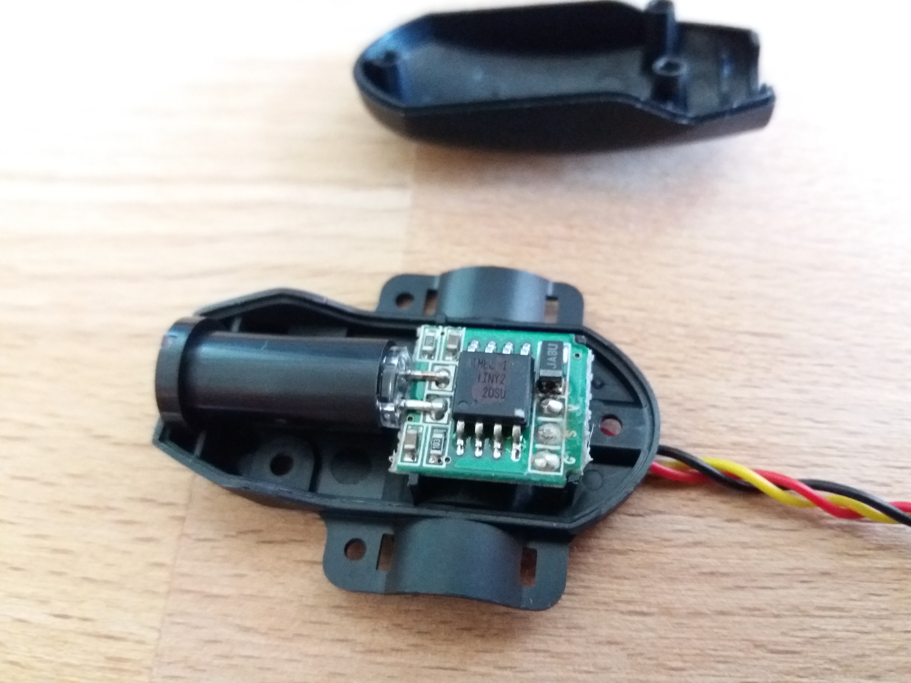

# HTS-ORPM - Optical RPM Sensor
Part No: 55833

[Hitec Multiplex Optical RPM sensor](https://hitecrcd.com/products/aircraft-radios-receivers-and-accessories/telemetry-systems-components/telemetry-components-/hts-orpm-optical-rpm-sensor/product) interface converter. The sensor is designed for use with helicopters, this sensor provides RPM information using an optical sensor.
The interface is proprietary Hitec Multiplex protocol.

The arduino code contained in this repository does readout of RPM from the sensor and print it in to serial console.  The measuring principle is based on detection of periodic change of brightness which is generated by moving element ahead of the sensor. The light is expected to be generated by the sky. The measuring principle is therefore unsuitable for application where many other obstacle presents, like trees etc.
The insufficient reliability of the sensor is a main reason why we do not use it.
